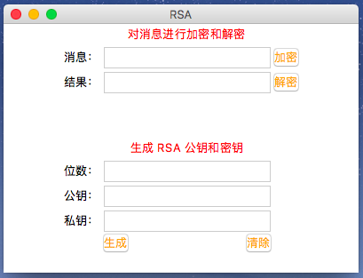
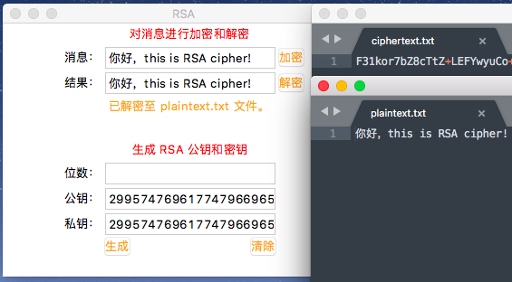
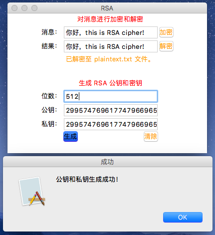
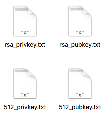

## RSA 加解密的 Python 实现

### 环境

1. 使用的 Python 版本是：Python 3.6.3。
2. 无使用其他第三方库，根据密码学实验要求纯手工实现。

### 使用

**进行加密**

在得到的项目文件夹下使用如下命令即可启动 GUI 界面，先点击生成按钮生成密钥，然后输入待加密明文，点击加密/解密按钮即可：

```Python
$ python3 main.py
```

**注意事项：**

* RSA 属公钥密码体制，所以在运行过程中会在本地生成 rsa_pubkey.txt 和 rsa_privkey.txt 文件，用于存储公钥和私钥。
* 密钥的位数默认为1024位，填充规则选用 PKCS1-PADDING，即对1024位的密钥，其字节为128位，对输入的数据将会采用 128 - 11 = 117 字节为一个分组进行加密，不足117字节的将会选择随机数进行填充。  
* 输入明文不用在意个数，最好是在200字符以内。
* 加密结果会用 Base64 进行编码，并存储在 ciphertext.txt 文件中；解密结果将存储在 plaintext.txt 文件中。





**选择加密位数**

在位数框输入框中输入想要的生成的密钥的位数后，点击生成即可生成对应位数的公私钥：



可以看到新生成的公私钥文件：




### 拓展

参考 operation.py 和 rsa.py 文件，可对其功能进行拓展。